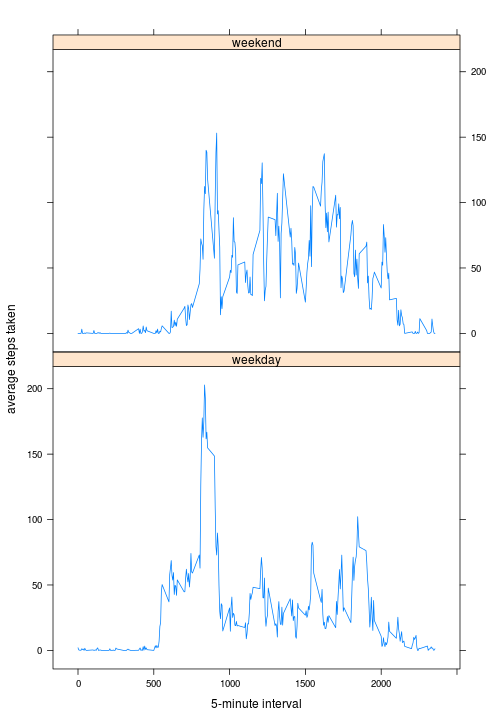

# Reproducible Research: Peer Assessment 1


## Loading and preprocessing the data

Load data file.


```r
D <- read.csv("activity.csv", colClasses = c("integer", "Date", "integer"))
str(D)
```

```
## 'data.frame':	17568 obs. of  3 variables:
##  $ steps   : int  NA NA NA NA NA NA NA NA NA NA ...
##  $ date    : Date, format: "2012-10-01" "2012-10-01" ...
##  $ interval: int  0 5 10 15 20 25 30 35 40 45 ...
```

```r
head(D)
```

```
##   steps       date interval
## 1    NA 2012-10-01        0
## 2    NA 2012-10-01        5
## 3    NA 2012-10-01       10
## 4    NA 2012-10-01       15
## 5    NA 2012-10-01       20
## 6    NA 2012-10-01       25
```


## What is mean total number of steps taken per day?

A histogram of the total number of steps taken each day.


```r
D.step <- tapply(D$steps, D$date, sum, na.rm = TRUE)
hist(D.step, xlab = "Total number of steps taken each days", ylab = "Number of days", 
    breaks = 10)
```

 


```r
D.sum <- summary(D.step)
str(D.sum)
```

```
## Classes 'summaryDefault', 'table'  Named num [1:6] 0 6780 10400 9350 12800 21200
##   ..- attr(*, "names")= chr [1:6] "Min." "1st Qu." "Median" "Mean" ...
```


The mean and median total number of steps taken
per day are respectively 9350 and 10400.

## What is the average daily activity pattern?

Time series plot of the average steps taken in each 5-minute interval across all the days.


```r
D.interval <- tapply(D$steps, D$interval, mean, na.rm = TRUE)
str(D.interval)
```

```
##  num [1:288(1d)] 1.717 0.3396 0.1321 0.1509 0.0755 ...
##  - attr(*, "dimnames")=List of 1
##   ..$ : chr [1:288] "0" "5" "10" "15" ...
```

```r
plot(D.interval, type = "l", xlab = "5-minute interval", ylab = "average of steps taken")
```

 


Which 5-minute interval on avarage contains the maximum?


```r
D.asc <- D.interval[order(-D.interval)]
D.maxintvl <- D.asc[1]
```


The 5-minute interval of 835 contains 206.1698 as the maximum value.

## Imputing missing values


```r
D.na <- sum(is.na(D$steps))
```


The total number of missing values is 2304.

Assign median of 5-minute interval to missing values of data. 


```r
D.medianintvl <- tapply(D$steps, D$interval, median, na.rm = TRUE)
D.filter <- D
for (i in names(D.medianintvl)) {
    D.filter$steps <- replace(D.filter$steps, which(is.na(D.filter$steps)), 
        D.medianintvl[[i]])
}
```


The histogram of the total number of steps taken each days.


```r
D.step2 <- tapply(D.filter$steps, D.filter$date, sum)
hist(D.step2, xlab = "Total number of steps taken each days", ylab = "Number of days", 
    breaks = 10)
```

 


The mean and median total number of steps taken per days.

```r
D.mean <- tapply(D$steps, D$date, mean)
D.median <- tapply(D$steps, D$date, median)
D.mean2 <- tapply(D.filter$steps, D.filter$date, mean)
D.median2 <- tapply(D.filter$steps, D.filter$date, median)
hist(D.mean, breaks = 10)
```

 

```r
hist(D.mean2, breaks = 10)
```

 


When we compare two histogram of median total number of steps taken per days, we found that higher distribution around steps of 0 indicates that most of the missing values are treated as 0 for median value. Imputing missing values changes the distribution to higher density near 0.

## Are there differences in activity patterns between weekdays and weekends?

Add a new column for weekdays with two levels of "weekday" and "weekend".


```r
D.filter$week <- !(weekdays(D.filter$date, abbreviate = TRUE) %in% c("土", 
    "日"))
D.filter$week <- factor(D.filter$week, levels = c(TRUE, FALSE), labels = c("weekday", 
    "weekend"))
head(D.filter)
```

```
##   steps       date interval    week
## 1     0 2012-10-01        0 weekday
## 2     0 2012-10-01        5 weekday
## 3     0 2012-10-01       10 weekday
## 4     0 2012-10-01       15 weekday
## 5     0 2012-10-01       20 weekday
## 6     0 2012-10-01       25 weekday
```


The time series plot of 5-minute interval and steps taken all the weekdays and weekends.


```r
library(lattice)
D.filter.mean <- tapply(D.filter$steps, list(D.filter$interval, D.filter$week), 
    mean)
D.aggr <- aggregate(steps ~ interval + week, D.filter, mean)
head(D.aggr)
```

```
##   interval    week   steps
## 1        0 weekday 2.02222
## 2        5 weekday 0.40000
## 3       10 weekday 0.15556
## 4       15 weekday 0.17778
## 5       20 weekday 0.08889
## 6       25 weekday 1.31111
```

```r
xyplot(steps ~ interval | week, data = D.aggr, type = "l", xlab = "5-minute interval", 
    ylab = "average steps taken")
```

 

```r
# head(D.filter.mean)
```

